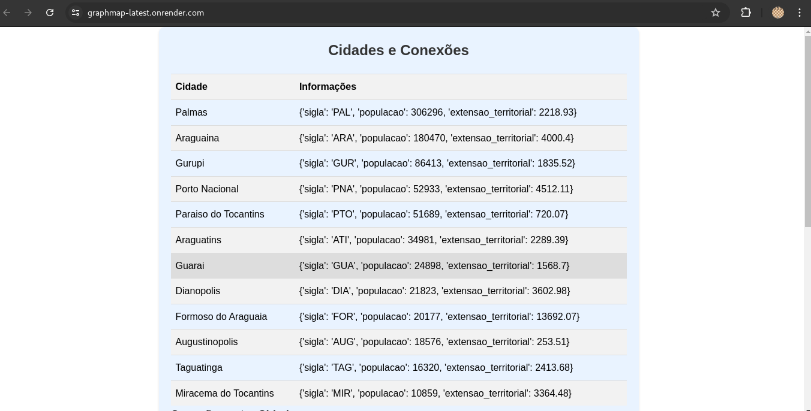

# 🗺 Mapa Grafos

#### O presente projeto se trata de um trabalho da faculdade envolvendo a criação de uma estrutura de relacionamento de cidades do estado do Tocantins utilizando Grafos.

---
## 🛠 Tech Stack
- Cliente:

	<code></code>
	<code></code>

- Servidor:

	
	

---
- Infra: 

	<code></code>

---

## 💻🖱️ Como usar 

Clone este repositório no seu computador, verifique se seu computador tem todas as depêndencias necessárias instaladas (elas estão no requirements.txt, dentro da pasta `src`). Logo após instalar todas as dependencias necessárias, navegue até a pasta `src` e execute o comando `python3 app.py` ou `python app.py`, e abra a url exposta no terminal.

Ou se preferir, poderá utilizar a versão em produção deste [link](https://graphmap-latest.onrender.com/)

---
## 🗺️ Layout
